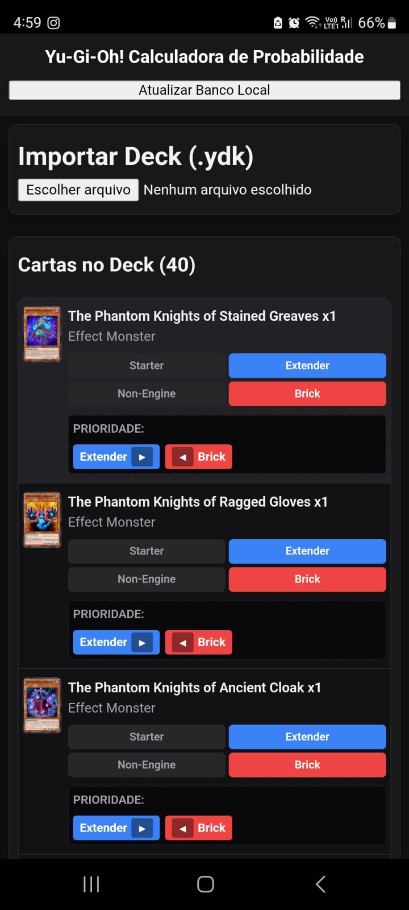
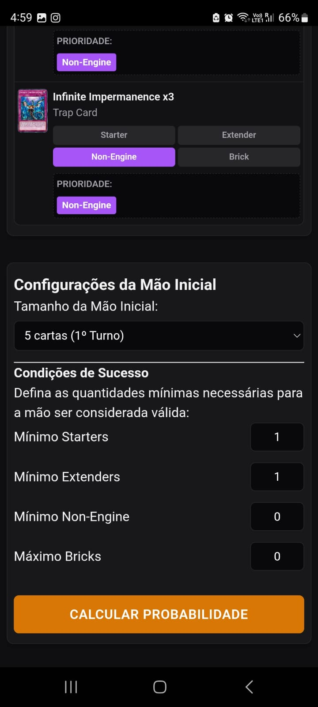
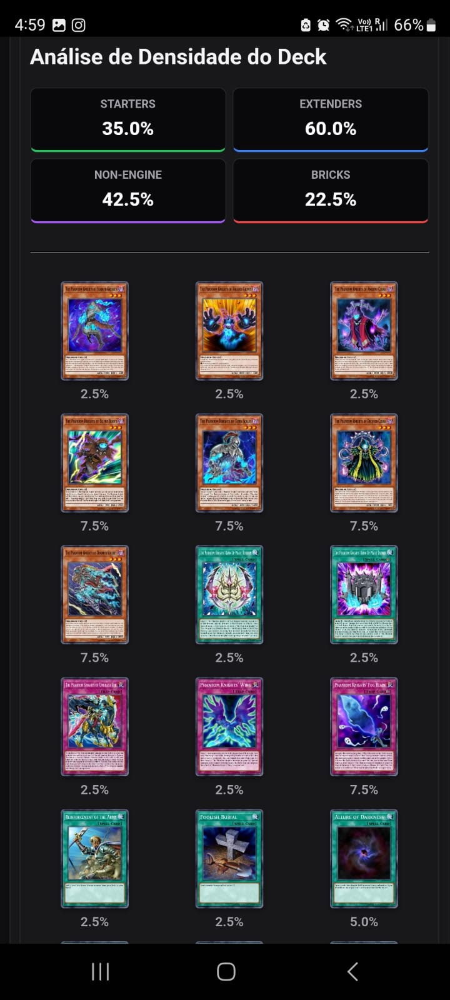
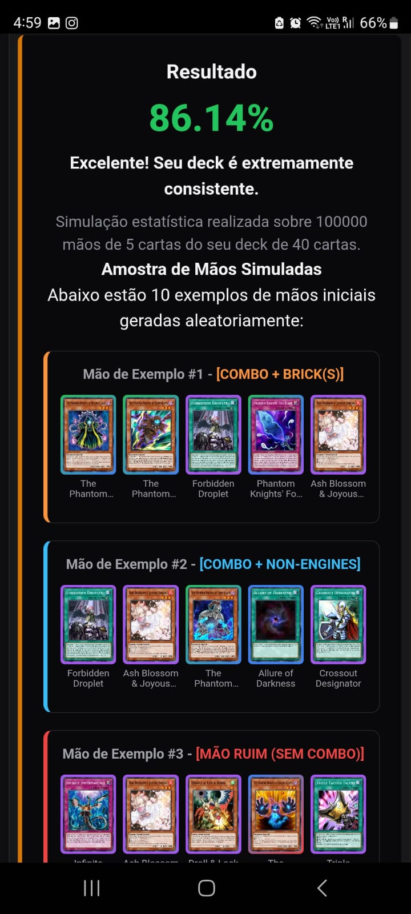

# Yu-Gi-Oh! Hand Calculator (Mobile)

An intuitive, lightweight, and mobile-optimized hand probability calculator and opening-hand simulator for **Yu-Gi-Oh!**. Built with modern web technologies and wrapped with **Capacitor**, this app lets you test deck consistency, evaluate card density, and run opening-hand simulations directly on your Android device.

---

### Desktop Version
Looking for the web/desktop version of this tool? Check out the original project repository here:
👉 [**Yu-Gi-Oh! Hypergeometric Hand Calculator (Desktop)**](https://github.com/IvanGSilva/yugioh_hypergeometric_hand_calculator)

---

## Features

* **Hypergeometric Probability Engine:** Accurately calculate the exact mathematical odds of drawing your key card combinations in your opening hand.
* **Monte Carlo Hand Simulator:** Simulate 5 or 6-card opening hands on the fly with smooth, touch-friendly horizontal scrolling.
* **Dynamic Card Categorization:** Tag your deck's cards as **Starters**, **Extenders**, **Non-Engine**, or **Bricks** to get deep insights into your deck's ratios.
* **Density & Priority Analysis:** View visual breakdowns and priority ordering to fine-tune your deck building before attending local tournaments or competitive events.
* **Mobile-First Responsive Design:** Clean, dark-mode UI optimized for small screens, one-handed navigation, and seamless performance.
* **YDK File Support:** Easily load your deck lists directly using standard `.ydk` files.

---

## Interface Preview

<table border="0">
  <tr>
    <td width="25%">
      
    </td>
    <td width="25%">
      
    </td>
    <td width="25%">
      
    </td>
    <td width="25%">
      
    </td>
  </tr>
</table>


---

## Installation (Android)

You can install the app directly on your Android device using the standalone APK from the Releases section:

1. Go to the [**Releases**](https://github.com/IvanGSilva/yugioh-hand-calculator-mobile/releases) tab in this repository.
2. Download the latest **`yugioh-hand-calculator.apk`** (or `app-debug.apk`).
3. Open the downloaded file on your Android device.
4. If prompted, grant permission to *"Install apps from unknown sources"* for your file browser.
5. Launch the app and test your hands!

---

## Tech Stack & Built With

* **Frontend:** HTML5, Custom CSS3 (Flexbox & CSS Grid), Pure JavaScript (ES6+)
* **Mobile Wrapper:** [Capacitor JS](https://capacitorjs.com/) (Native Android bridge)
* **Design/UI:** Custom Dark Theme tailored for mobile viewports (`100vw` constrained layout, custom touch-scrollbars)

---

## Local Development Setup

If you want to clone and run or build the project locally:

```bash
# 1. Clone the repository
git clone [https://github.com/IvanGSilva/yugioh-hand-calculator-mobile.git](https://github.com/IvanGSilva/yugioh-hand-calculator-mobile.git)

# 2. Enter the project directory
cd yugioh-hand-calculator-mobile

# 3. Install Node dependencies
npm install

# 4. Sync web assets with the Android native project
npx cap sync android
```

## Contributing & Feedback

Feel free to open an Issue or submit a Pull Request if you run into any bugs, have ideas for new features, or want to contribute to the calculator's engine!

## License

This project is open-source under the MIT License.
